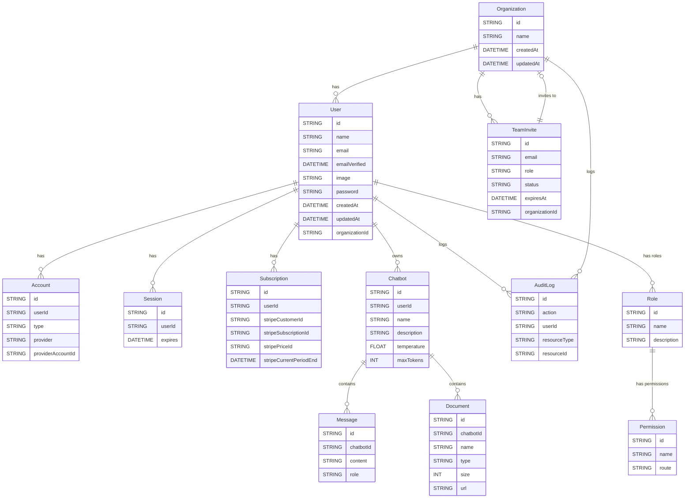

# Prisma Schema Documentation

This document provides a detailed description of the Prisma schema, including models and their relationships.

## Relationship Diagram

The following diagram illustrates the relationships between the models using Mermaid:

### Model Details

#### Organization

Represents an organization.

- **Fields**:
  - `id`: Unique identifier.
  - `name`: Organization name.
  - `createdAt`: Timestamp when created.
  - `updatedAt`: Timestamp when last updated.
  - Relationships:
    - `users`: List of users in the organization.
    - `auditLogs`: Audit logs associated with the organization.
    - `invites`: Team invites sent by the organization.

#### Account

Stores user account information.

- **Fields**:
  - `id`: Unique identifier.
  - `userId`: Reference to the associated user.
  - `type`, `provider`, `providerAccountId`: Provider details.
  - `refresh_token`, `access_token`: Tokens for authentication.
  - Relationships:
    - `user`: User associated with the account.

#### Session

Tracks user sessions.

- **Fields**:
  - `id`: Unique identifier.
  - `sessionToken`: Unique session token.
  - `userId`: Reference to the associated user.
  - `expires`: Session expiration time.
  - Relationships:
    - `user`: User associated with the session.

#### User

Represents an application user.

- **Fields**:
  - `id`: Unique identifier.
  - `name`, `email`, `password`: User details.
  - `organizationId`: Reference to the associated organization.
  - Relationships:
    - `organization`: Organization the user belongs to.
    - `accounts`, `sessions`: User accounts and sessions.
    - `chatbots`: List of chatbots created by the user.
    - `roles`: Roles assigned to the user.

#### Subscription

Tracks user subscriptions.

- **Fields**:
  - `id`: Unique identifier.
  - `userId`: Reference to the user.
  - `stripeCustomerId`, `stripeSubscriptionId`: Stripe details.
  - Relationships:
    - `user`: User associated with the subscription.

#### Chatbot

Represents a chatbot created by a user.

- **Fields**:
  - `id`: Unique identifier.
  - `name`, `description`: Chatbot details.
  - `model`, `temperature`, `maxTokens`: Configuration settings.
  - Relationships:
    - `user`: User who created the chatbot.
    - `messages`, `documents`: Associated messages and documents.

#### Message

Stores messages exchanged with a chatbot.

- **Fields**:
  - `id`: Unique identifier.
  - `content`: Message content.
  - `role`: Role of the message sender.
  - Relationships:
    - `chatbot`: Chatbot associated with the message.

#### Document

Represents a document uploaded to a chatbot.

- **Fields**:
  - `id`: Unique identifier.
  - `name`, `type`, `size`, `url`: Document details.
  - Relationships:
    - `chatbot`: Chatbot associated with the document.

#### AuditLog

Tracks actions performed in the application.

- **Fields**:
  - `id`: Unique identifier.
  - `action`: Description of the action.
  - `userId`: Reference to the user who performed the action.
  - `organizationId`: Reference to the organization associated with the action.
  - Relationships:
    - `user`: User who performed the action.
    - `organization`: Organization associated with the action.

#### TeamInvite

Represents a team invitation.

- **Fields**:
  - `id`: Unique identifier.
  - `email`: Email of the invitee.
  - `role`, `status`: Invitation details.
  - Relationships:
    - `organization`: Organization sending the invitation.

#### Role

Defines roles within the application.

- **Fields**:
  - `id`: Unique identifier.
  - `name`: Role name.
  - Relationships:
    - `permissions`: Permissions associated with the role.
    - `users`: Users assigned to the role.

#### Permission

Represents permissions assigned to roles.

- **Fields**:
  - `id`: Unique identifier.
  - `name`, `route`: Permission details.
  - Relationships:
    - `roles`: Roles that include this permission.
